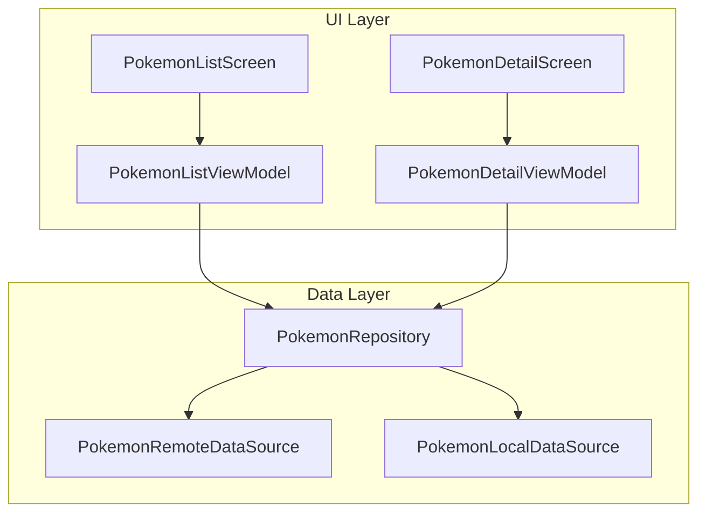
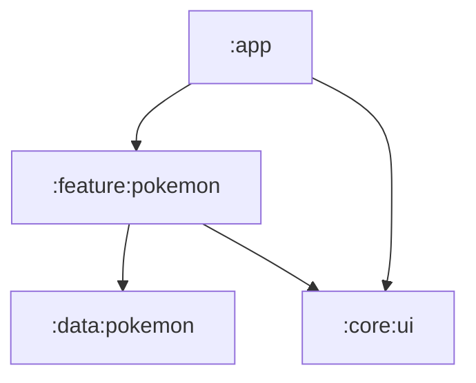
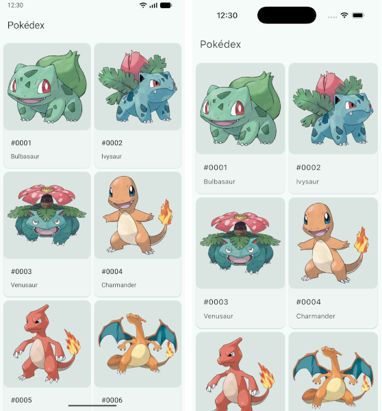

# Pokédex

This sample demonstrates best practices for
[Modern Android Development](https://developer.android.com/modern-android-development).

## Architecture

It follows the
[guide to app architecture](https://developer.android.com/topic/architecture).

## Modularization

It follows the
[guide to app modularization](https://developer.android.com/topic/modularization).

## Dependency injection

It follows the principles of
[dependency injection](https://developer.android.com/training/dependency-injection)
using
[Koin](https://insert-koin.io/).

## Testing

It follows the principles of
[testing](https://developer.android.com/training/testing)
using
[MockK](https://mockk.io/)
and
[Robolectric](https://robolectric.org/).

## Screenshots

